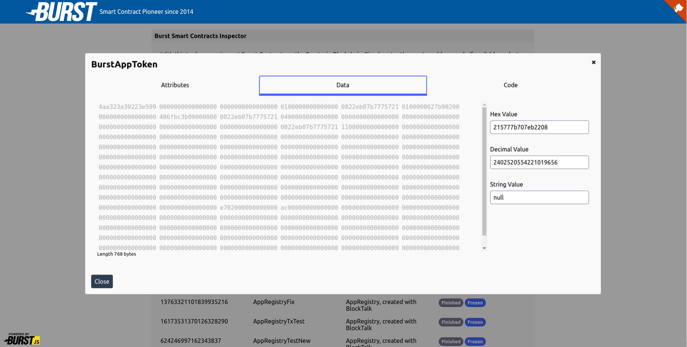

#### [Contracts Inspector]()

> Level: Advanced
> This is a larger code base of a useful tool, which requires solid understanding of Browsers WebAPI, especially DOM 

This example application lists all [Smart Contracts](https://github.com/burst-apps-team/blocktalk) of an account, and allows detailed inspection

[Go to live app](https://contracts-inspector.ohager.vercel.app/)

Run the `index.html` in any static file server.

Using [serve](https://www.npmjs.com/package/serve) may be the easiest way:

1. `npm i -g serve`
2. `cd ./web/vanilla/contracts-inspector`
3. `serve`
4. Open browser at given url, i.e. `http://localhost:5000`

Additional Url parameters

- address: A burst address or account id
- testnet: If passed the testnet will be chosen, otherwise mainnet

``

##### Used methods/classes:
	- core/apiCompose
	- core/api.account.getContractsByAccount
	- core/ContractHelper
	- util/convertAddressToNumericId
	- crypto/hashSHA256
